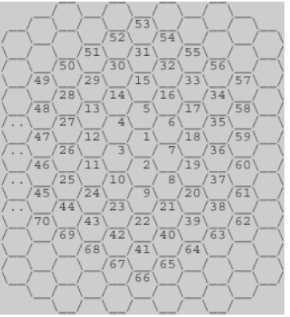

알고리즘 문제 풀이
==================

002. 벌집
---------------

2018.02.15
추천자 Haenara Shin
https://www.acmicpc.net/problem/2292

# 문제 소개
## 문제

위의 그림과 같이 육각형으로 이루어진 벌집이 있다. 그림에서 보는 바와 같이 중앙의 방 1부터 시작해서 이웃하는 방에 돌아가면서 1씩 증가하는 번호를 주소로 매길 수 있다. 숫자 N이 주어졌을 때, 벌집의 중앙 1에서 N번 방까지 최소 개수의 방을 지나서 갈 때 몇 개의 방을 지나가는지(시작과 끝을 포함하여)를 계산하는 프로그램을 작성하시오. 예를 들면, 13까지는 3개, 58까지는 5개를 지난다.
## 입력
첫째 줄에 N(1 ≤ N ≤ 1,000,000,000)이 주어진다.
## 출력
입력으로 주어진 방까지 최소 개수의 방을 지나서 갈 때 몇 개의 방을 지나는지 출력한다.
## 예제 입력
13
## 예제 출력
3

# 선정 이유
몸풀기 다음으로 규칙을 찾는 문제를 선정. 언뜻보면 굉장히 어려워 보이지만 수학적으로 접근해보면 사실 굉장히 쉬운 문제니까 포기하지 않고 도전해보길!

## Hint
1. 수학적으로 접근해보자.
2. 6각형이다! 6각형!!
3. Output이 Y일 때 Input이 될 수 있는 최대갑 X와 최소값 x를 생각해보자.

